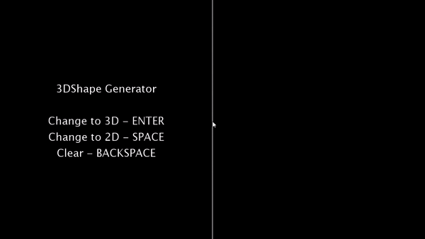

# Pong with Processing
## About the author
Miguel Herrera Álvarez. Last-year Computer Engineering student in the University of Las Palmas de Gran Canaria.

## Develop
3D Shape generator with Processing.

### Decisions
- Controls:
    - ENTER key to 3D vision.
    - SPACE key to 2D vision.
    - BACKSPACE key to clean points in 2D.
    - Left mouse button to draw points in 2D and move shape in 3D.

## Tools and references
- [Processing 3.5.4](http://processing.org/)

## Take a peek of result

